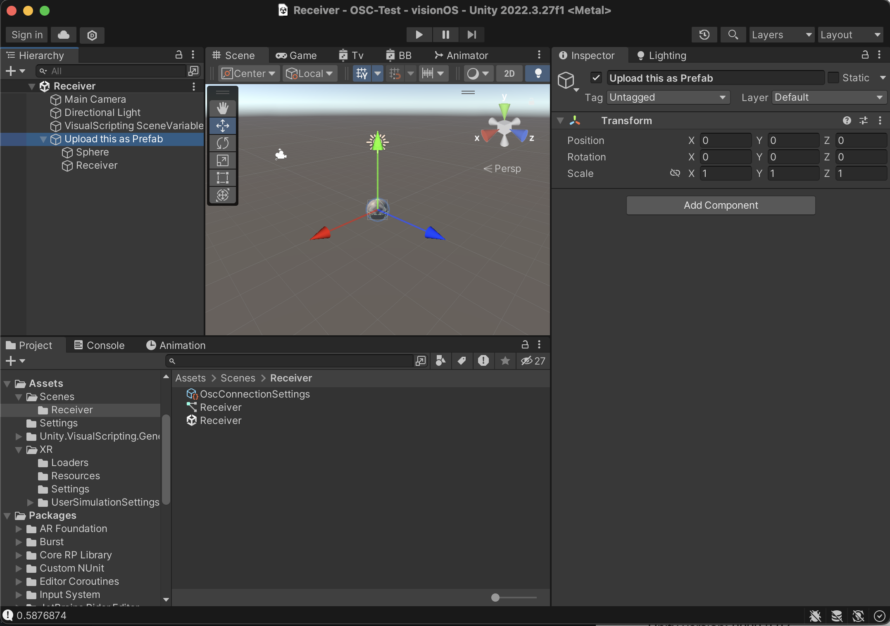
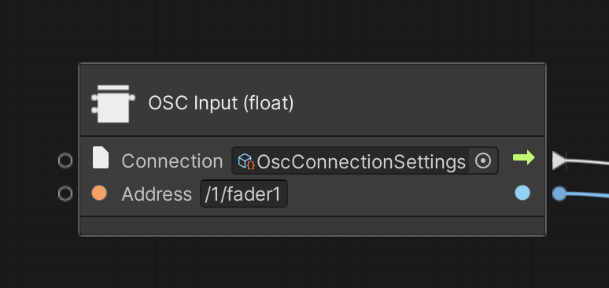
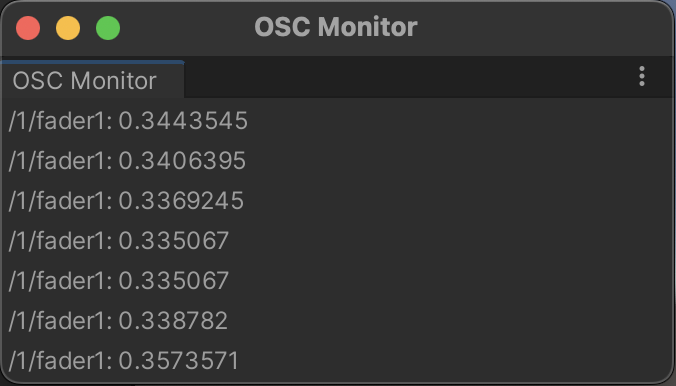

[STYLY for Vision Pro](https://spatial-layer.styly.cc/) supports [OscJackVS](https://github.com/keijiro/OscJackVS) for receiving [OSC](https://opensoundcontrol.stanford.edu/) messages in contents. This is a simple example controlling contents by OSC. This project is built on Unity 2022.3.27.

You can down load the latest version of this project via [this link](https://api.github.com/repos/ku6ryo/OSC-Sample_STYLY-for-VisionPro/zipball/).

# Controller
This demo Unity project assumes that you're using [TouchOSC iOS app](https://apps.apple.com/jp/app/touchosc-mk1/id288120394). However, you can use other OSC controllers (app, devices) for STYLY. Please capture how to realize OSC communication through this project.

## TouchOSC app settings

 Before you start working this project, please setup TouchOSC app. Go to setting and select `Beatmachin` as the layout. We use the `yellow fader` in the left as the controller of this project. Then, please set Host with your Vision Pro's local IP address (In testing phase on Unity Editor, please set your PC's local IP address. It is not your global IP address for the Internet!). You can keep the port number *Port (outgoing)* as the default `8000`.
 
 Following links navigates you to how to get IP address of the following devices.
 - [Vision Pro](https://www.youtube.com/watch?v=OXGVivV84zM)
 - [Mac](https://www.security.org/vpn/find-mac-ip-address/)
 
# Unity project
The content in this project is controlling Y position of a sphere by OSC.

This project uses [OscJack](https://github.com/keijiro/OscJack) and [OscJackVS](https://github.com/keijiro/OscJackVS) which are already included in this project. If you implement OSC communication faeture to your own project, please import the Unity packages first.

Please open "Receiver" Unity scene in Unity Editor. The scene is in [Assets] --> [Scenes] --> [Receiver].

In the same folder as the scene, there is a OscConnectionSetting file and a VisualScripting graph.

For the port setting in OscConnectionSetting, please use the port number you set in TouchOSC app.

Please play the scene in Unity Editor and make sure that it works with TouchOSC app by sliding the yellow fader (Please do not forget to set your PC's IP address in TouchOSC settings.).

You can learn how to make the scripting graph by checking the VisulalScripting graph. The image below is the node to listen message from the controller.

You see the `Osc Connection Settings` created above as the `Connection` parameter and `/1/fader1` as the Address (Each fader UI component has a different address). The node provides a float value which corresponds to the position of the slider. By setting the value to Y position of the sphere, it realize controlling the sphere position by TouchOSC app.

# Appendix

## How to find addresses of controller UI components (fader, push, toggle etc.)
On Unity Editor, OscJack has a monitoring tool `OSC Monitor` for OSC messages. Please open it through [Window] --> [OSC Monitor]. When you play the scene and manipilate controller UI componens, the addresses and values are showin the tool. By using that, you can find addresses of controller UI components and can use them in VisualScripting.

